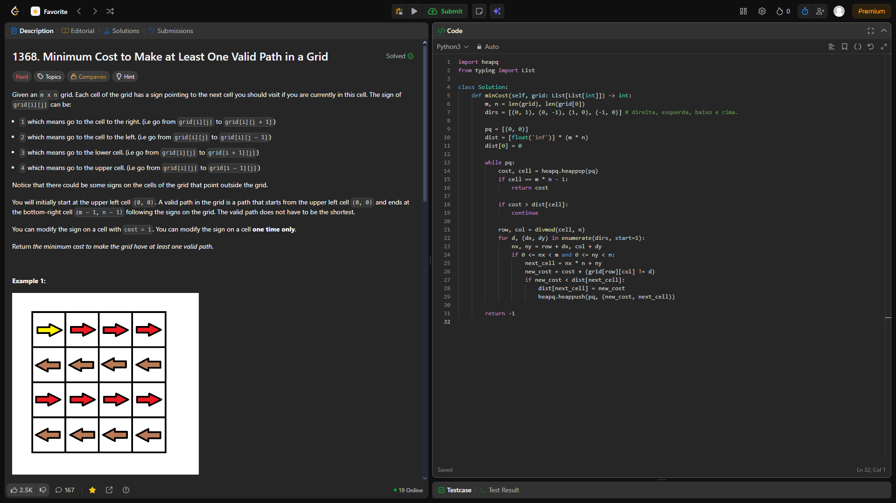
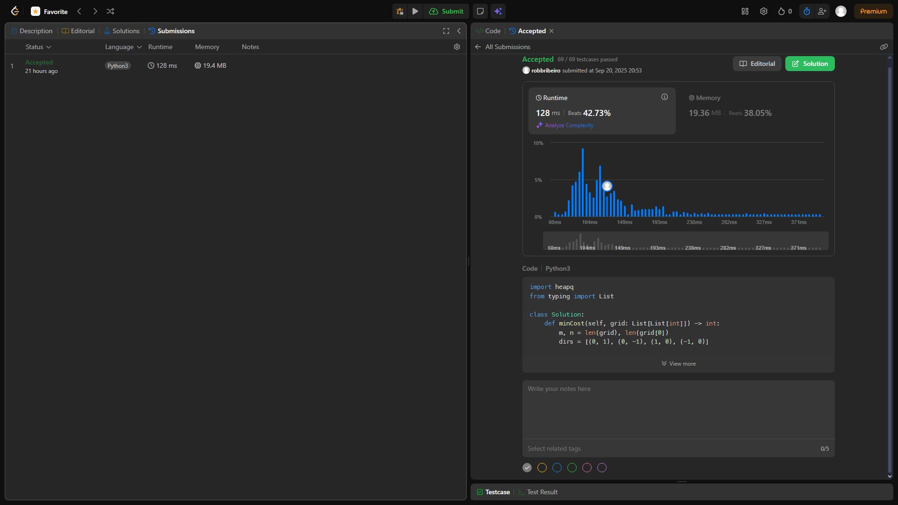
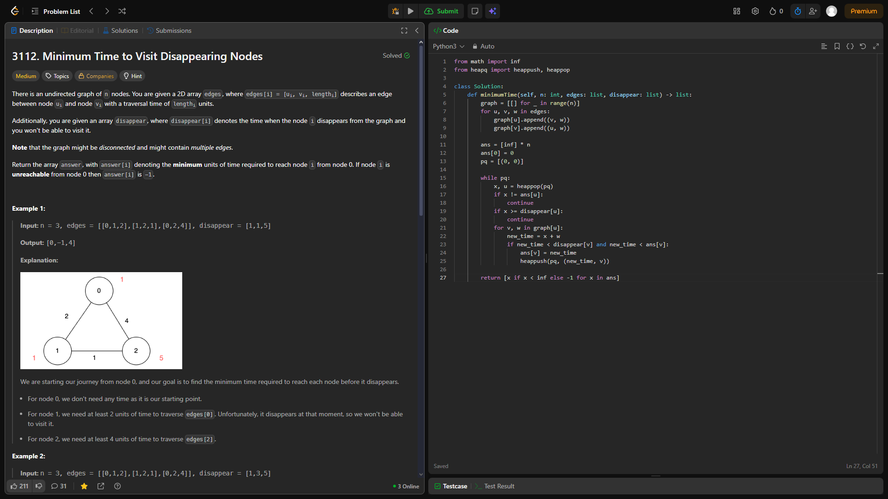
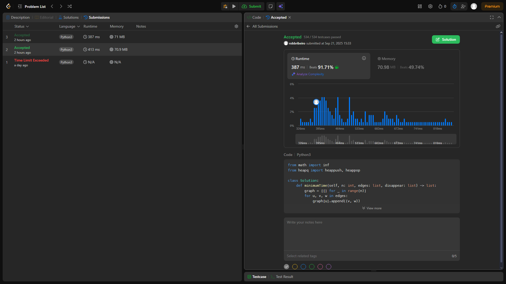
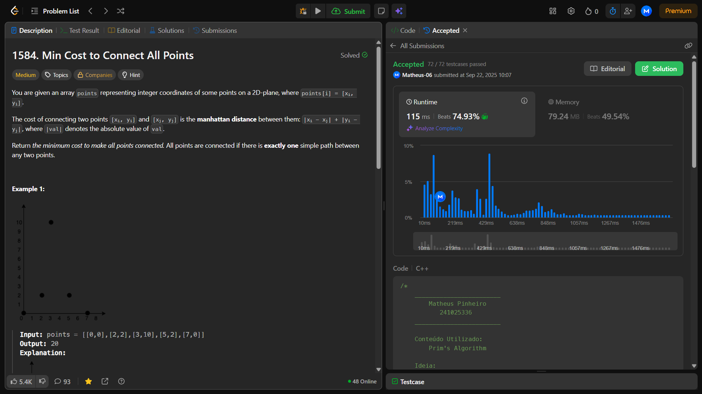
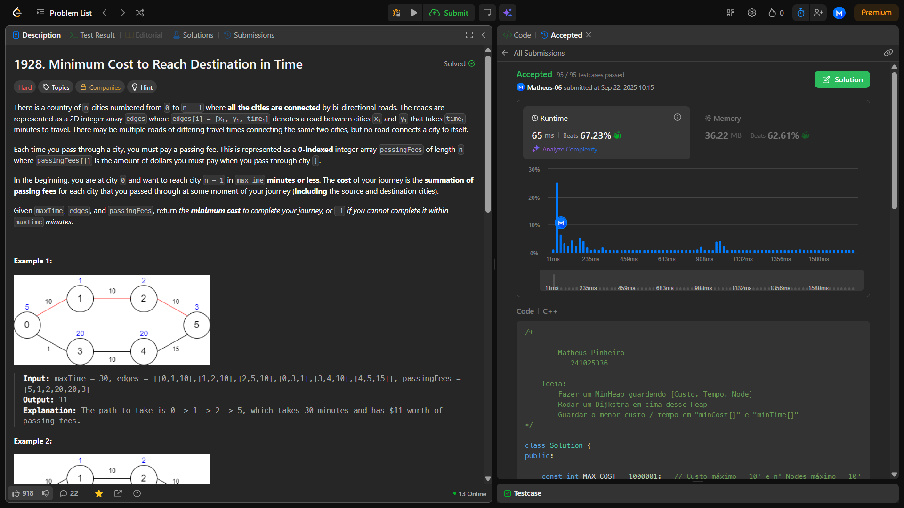

# Grafos-1_Dupla-60

**Número da Lista**: 60 
**Conteúdo da Disciplina**: Grafos-2 

## Alunos
|Matrícula | Aluno |
| -- | -- |
| 24/1025336  |  Matheus Pinheiro |
| 22/1022730   |  Robson Junio Ribeiro Macedo |

## Sobre 
Foram escolhidos quatro exercícios da plataforma online e dividido entre a dupla [LeetCode](https://leetcode.com/):
- Dois de nível difícil.
- Dois de nível médio.

## Screenshots
-[1368. Minimum Cost to Make at Least One Valid Path in a Grid (Díficil)](https://leetcode.com/problems/minimum-cost-to-make-at-least-one-valid-path-in-a-grid/)

[Código](code/1368.py)

-[3112. Minimum Time to Visit Disappearing Nodes (Médio)](https://leetcode.com/problems/minimum-cost-to-make-at-least-one-valid-path-in-a-grid/)

[Código](code/3112.py)

-[1584. Min Cost to Connect All Points (Médio)](https://leetcode.com/problems/min-cost-to-connect-all-points/description/)

[Código](code/1584.cpp)

-[1928. Minimum Cost to Reach Destination in Time (Difícil)](https://leetcode.com/problems/minimum-cost-to-reach-destination-in-time/description/)

[Código](code/1928.cpp)

## Instalação 
**Linguagem**: Python e C++  

## Video
[Video](link do video)

## Outros 
[Slide Usado](link do slide)

